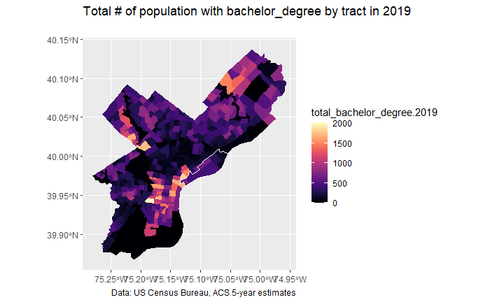

Lab2\_assignment
================
Somang (So) Han
9/14/2021

``` r
library(tidyverse)
library(tidycensus)
library(sf)
library(tmap) # mapping, install if you don't have it
set.seed(717)
```

This assignment if for you to complete a short version of the lab notes,
but you have to complete a number of the steps yourself. You will then
knit this to a markdown (not an HTML) and push it to your GitHub repo.
Unlike HTML, the RMarkdown knit to `github_document` can be viewed
directly on GitHub. You will them email your lab instructor with a link
to your repo.

Steps in this assignment:

1.  Make sure you have successfully read, run, and learned from the
    `MUSA_508_Lab2_sf.Rmd` Rmarkdown

2.  Find two new variables from the 2019 ACS data to load. Use `vars <-
    load_variables(2019, "acs5")` and `View(vars)` to see all of the
    variable from that ACS. Note that you should not pick something
    really obscure like count\_38yo\_cabinetmakers because you will get
    lots of NAs.

3.  Pick a neighborhood of the City to map. You will need to do some
    googling to figure this out. Use the [PHL Track
    Explorer](https://data-phl.opendata.arcgis.com/datasets/census-tracts-2010/explore?location=40.002759%2C-75.119097%2C11.91)
    to get the `GEOID10` number from each parcel and add them to the
    `myTracts` object below. This is just like what was done in the
    exercise, but with a different neighborhood of your choice. Remember
    that all GEOIDs need to be 10-characters long.

4.  In the first code chunk you will do that above and then edit the
    call-outs in the dplyr pipe sequence to `rename` and `mutate` your
    data.

5.  You will transform the data to `WGS84` by adding the correct EPSG
    code. This is discussed heavily in the exercise.

6.  You will produce a map of one of the variables you picked and
    highlight the neighborhood you picked. There are call-out within the
    `ggplot` code for you to edit.

7.  You can run the code chunks and lines of code as you edit to make
    sure everything works.

8.  Once you are done, hit the `knit` button at the top of the script
    window (little blue knitting ball) and you will see the output. Once
    it is what you want…

9.  Use the `Git` tab on the bottom left of right (depending on hour
    your Rstudio is laid out) and click the check box to `stage` all of
    your changes, write a commit note, hit the `commit` button, and then
    the `Push` button to push it to Github.

10. Check your Github repo to see you work in the cloud.

11. Email your lab instructor with a link\!

12. Congrats\! You made a map in code\!

## Load data from {tidycensus}

``` r
# vars <- load_variables(2019, "acs5")
# View(vars)
```

``` r
acs_vars <- c( "B01001_001",    # age 
               "B01003_001", # total pop
               "B06009_005") # education 


myTracts <- c("42101037800", 
              "42101018300", 
              "42101018400",
              "42101037900",
              "42101014300")


acsTractsPHL.2019.sf <- get_acs(geography = "tract",
                             year = 2019,
                             variables = acs_vars,
                             geometry = TRUE,
                             state  = "PA",
                             county = "Philadelphia",
                             output = "wide") %>%
  dplyr::select (GEOID, NAME, all_of(paste0(acs_vars,"E"))) %>%
  rename (total_pop.2019 = B01003_001E, 
          total_sexbyage.2019 = B01001_001E, 
          total_bachelor_degree.2019 = B06009_005E) %>%
  mutate(Neighborhood = ifelse(GEOID %in% myTracts,
                               "River Wards",
                               "REST OF PHILADELPHIA"))
```

## Transform to WGS84 with {sf}

``` r
class(acsTractsPHL.2019.sf)
```

    ## [1] "sf"         "data.frame"

``` r
head(acsTractsPHL.2019.sf,2)
```

    ## Simple feature collection with 2 features and 6 fields
    ## Geometry type: MULTIPOLYGON
    ## Dimension:     XY
    ## Bounding box:  xmin: -75.15671 ymin: 39.91377 xmax: -75.14501 ymax: 39.97932
    ## Geodetic CRS:  NAD83
    ##         GEOID                                                  NAME
    ## 1 42101014500   Census Tract 145, Philadelphia County, Pennsylvania
    ## 2 42101004202 Census Tract 42.02, Philadelphia County, Pennsylvania
    ##   total_sexbyage.2019 total_pop.2019 total_bachelor_degree.2019
    ## 1                1868           1868                        152
    ## 2                5651           5651                        486
    ##                         geometry         Neighborhood
    ## 1 MULTIPOLYGON (((-75.15131 3... REST OF PHILADELPHIA
    ## 2 MULTIPOLYGON (((-75.15614 3... REST OF PHILADELPHIA

``` r
acsTractsPHL.2019.sf$geometry
```

    ## Geometry set for 384 features 
    ## Geometry type: MULTIPOLYGON
    ## Dimension:     XY
    ## Bounding box:  xmin: -75.28027 ymin: 39.86705 xmax: -74.95578 ymax: 40.13799
    ## Geodetic CRS:  NAD83
    ## First 5 geometries:

    ## MULTIPOLYGON (((-75.15131 39.97638, -75.15066 3...

    ## MULTIPOLYGON (((-75.15614 39.91752, -75.15586 3...

    ## MULTIPOLYGON (((-75.16396 39.91852, -75.16341 3...

    ## MULTIPOLYGON (((-75.17067 39.95013, -75.16752 3...

    ## MULTIPOLYGON (((-75.18653 40.05621, -75.18337 4...

``` r
acsTractsPHL.2019.sf <- acsTractsPHL.2019.sf %>% 
  st_transform(crs = "EPSG:4326")
```

## Plot with {ggplot2}

``` r
library(viridis)
```

    ## Warning: package 'viridis' was built under R version 4.0.5

    ## Loading required package: viridisLite

    ## Warning: package 'viridisLite' was built under R version 4.0.5

    ## 
    ## Attaching package: 'viridis'

    ## The following object is masked from 'package:viridisLite':
    ## 
    ##     viridis.map

``` r
ggplot()+
  geom_sf(data = acsTractsPHL.2019.sf, aes(fill = total_bachelor_degree.2019),
          color = "transparent")+
  geom_sf(data = acsTractsPHL.2019.sf %>%
            filter(Neighborhood == "River Wards") %>%
            st_union(),
          color = "white",
          fill = "transparent")+
   scale_fill_viridis(option="magma") +
  # Bonus to figure out different color ramps with scale_fill_viridis()
  labs(
    title = "Total # of population with bachelor_degree by tract in 2019",
    subtitle = "",
    caption = "Data: US Census Bureau, ACS 5-year estimates")
```


<!-- -->
